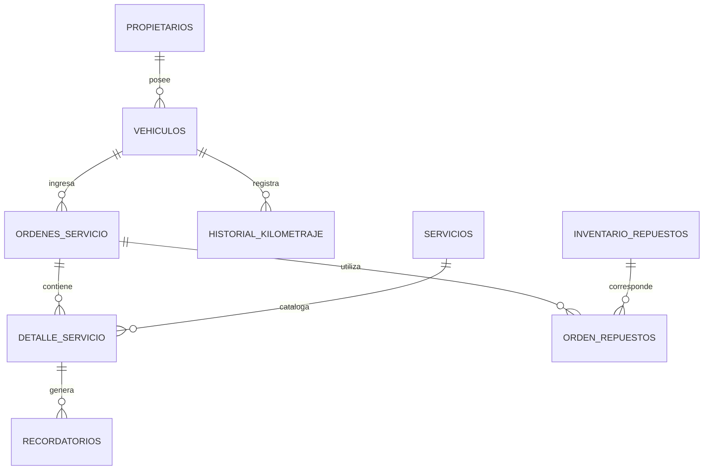

# Fase 2: diseño de datos

## 1. Decisiones de diseño

El modelo separa propietario, vehículo, orden y servicio ejecutado. Esta decisión evita duplicar nombres, teléfonos y datos del vehículo en cada orden, permite que una empresa tenga varios vehículos y conserva el historial sin sobrescribir atenciones anteriores.

La fecha de próximo mantenimiento pertenece a `detalle_servicio`, porque un vehículo puede recibir varios servicios en una misma orden y cada uno puede tener una periodicidad distinta. Los recordatorios también se asocian a ese detalle para controlar duplicados.

## 2. Modelo entidad-relación

## 3. Entidades principales

| Tabla | Finalidad | Clave y relaciones |
| --- | --- | --- |
| `propietarios` | Personas o empresas y sus contactos. | PK `id_propietario`; uno a muchos con vehículos. |
| `vehiculos` | Información técnica y operativa del vehículo. | PK `id_vehiculo`; FK a propietario; placa única. |
| `ordenes_servicio` | Cada ingreso y su ciclo de atención. | PK `id_orden`; FK a vehículo. |
| `servicios` | Catálogo de servicios preventivos y correctivos. | PK `id_servicio`. |
| `detalle_servicio` | Servicios realizados en una orden e información de próximo mantenimiento. | FK a orden y servicio. |
| `historial_kilometraje` | Kilometrajes registrados en cada ingreso. | FK a vehículo y, opcionalmente, a orden. |
| `recordatorios` | Mensajes internos de próximo mantenimiento. | FK a detalle de servicio. |
| `inventario_repuestos` | Catálogo y existencias de repuestos. | PK `id_repuesto`; código único. |
| `orden_repuestos` | Repuestos utilizados por una orden. | FK a orden y repuesto. |

## 4. Integridad y reglas técnicas

- Las placas y códigos de repuesto tienen índices únicos.
- Las relaciones se protegen con claves foráneas; no se permite borrar propietarios con vehículos ni vehículos con historial.
- Los estados se limitan mediante `ENUM`.
- Las fechas estimadas e índices de estado permiten consultar alertas eficientemente.
- Los campos monetarios usan `DECIMAL(12,2)` y los kilometrajes `DECIMAL(12,2)`.
- Un índice único en recordatorios evita duplicar el mismo aviso para el mismo servicio.

## 5. Estimación propuesta

Al cerrar un servicio preventivo, el encargado elige una fecha base recomendada para el próximo servicio. El nivel de uso ajusta esa fecha: `Bajo` aumenta el intervalo un 25 %, `Normal` mantiene el intervalo y `Alto` lo reduce un 25 %. La fecha finalmente calculada o validada se guarda en `detalle_servicio.fecha_proximo_servicio`.

Esta regla será implementada en la fase funcional. La fase actual proporciona las columnas y restricciones necesarias para almacenarla y consultarla.

## 6. Archivos entregados

- `database/01-schema.sql`: creación de la base, tablas, relaciones, índices y vistas de alertas.
- `database/02-seed.sql`: datos de prueba mínimos.
- `src/db-config.example.js`: plantilla de configuración sin credenciales.
